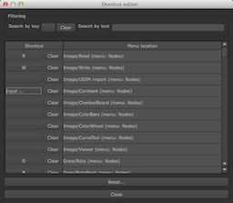

# Nuke shortcut editor

`shortcuteditor` is a keyboard shortcut editor for
[The Foundry's Nuke](http://www.thefoundry.co.uk/products/nuke)

It allows you to quickly bind keyboard shortcuts to existing menu
items without writing Python code

## Installation

Put `shortcuteditor.py` on PYTHONPATH or NUKE_PATH somewhere (probably
in `~/.nuke/`)

    mkdir -p ~/.nuke
    cd ~/.nuke
    curl -O https://raw.github.com/dbr/shortcuteditor-nuke/master/shortcuteditor.py

Then in `~/.nuke/menu.py` add the following:

    try:
        import shortcuteditor
        shortcuteditor.nuke_setup()
    except Exception:
        import traceback
        traceback.print_exc()

## Notes

Should work in Nuke 6.3v3 onwards (when the nuke.Menu.setShortcut
method was added)

The shortcuts overrides are saved in `~/.nuke/shortcuteditor_settings.json`

You can search for menu items either by name ("Search by text"), or by
existing shortcut ("Search by key"), or both (rarely necessary)

There are a few shortcuts you cannot (easily) override in the viewer
context, specifically things like the r/g/b and z/x/c shortcuts are
hardwired (as of Nuke 7 - might change in the future)

If you are changing an existing shortcut, be sure to clear the old
usage of the key (using the "Search by key")

## Future improvements

- Handle conflicting shortcuts better (highlight the shortcut in red
  when it conflicts or something?)
- Ability to view/clear specific overrides, rather than global
  "Reset.."

## Change log

* `v1.0`
 * Initial version
